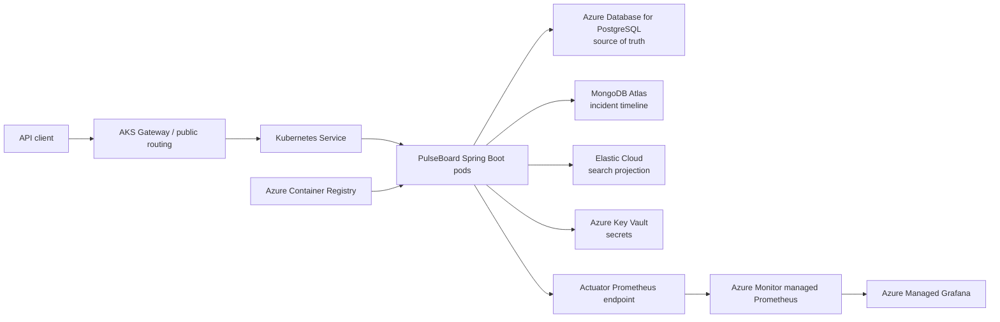

# PulseBoard Architecture Plan

## 1. Goal and scope

PulseBoard is a single Spring Boot microservice for authenticated incident tracking. It is designed as a 12–15 hour learning project covering Spring Boot, JPA/Hibernate, Spring Security, PostgreSQL, MongoDB, Elasticsearch, Prometheus, Grafana, Docker, Kubernetes, and Azure Kubernetes Service (AKS).

This is not a production architecture. The intent is to learn one useful responsibility of each technology with the smallest viable design.

### In scope

- Register and authenticate users with JWT authentication.
- Create, list, update, and resolve incidents.
- Add timeline entries to an incident.
- Search incidents by title, description, or service name.
- View application metrics and deploy the application container to AKS.

### Explicitly out of scope

- Frontend, API gateway, service discovery, message queues, CI/CD, notifications, refresh tokens, OAuth login, multi-region availability, and multi-service decomposition.

## 2. Architecture overview

## 3. Application responsibilities

The application remains a single deployable service. Keep packages separated by responsibility, but do not turn them into separate microservices.

| Area | Responsibility |
|---|---|
| Identity | Registration, password hashing, login, JWT validation, endpoint authorization |
| Incidents | Incident CRUD, validation, ownership checks, pagination |
| Timeline | Add and read timeline/audit entries for an incident |
| Search | Write and query the Elasticsearch incident projection |
| Operations | Health endpoints, metrics, structured logs, configuration |

## 4. Data ownership

| Store | Owns | Notes |
|---|---|---|
| PostgreSQL | users, roles, incidents, tags | Authoritative transactional data; accessed through Spring Data JPA/Hibernate |
| MongoDB | incident timeline entries | A document contains the incident ID, author ID, timestamp, message, and update type |
| Elasticsearch | searchable incident projection | A denormalized copy of searchable incident fields; never the source of truth |

### Key design decisions

- Use PostgreSQL as the source of truth for all core incident state.
- Store only an incident identifier in a MongoDB timeline document. Do not try to create a cross-database foreign key.
- Search indexing is eventually consistent. If PostgreSQL writes successfully but Elasticsearch indexing fails, the incident remains correct and searchable after a retry/re-index.
- Avoid distributed transactions across PostgreSQL, MongoDB, and Elasticsearch.

## 5. Core request flows

### Authentication

1. A user registers or logs in.
2. The service stores only a strong password hash in PostgreSQL.
3. Successful login returns a signed JWT.
4. Protected requests include the JWT; Spring Security authenticates it and applies authorization rules.

### Create or update an incident

1. The client calls a protected incident endpoint.
2. The service validates input and authorizes the caller.
3. The service saves the incident to PostgreSQL.
4. The service writes a corresponding timeline entry to MongoDB.
5. The service updates the Elasticsearch projection.
6. If a non-authoritative secondary write fails, record the error and repair it manually or through a simple retry; do not undo the PostgreSQL incident.

### Search

1. The client calls a protected search endpoint with text and an optional status/severity filter.
2. The service queries Elasticsearch.
3. Return search results as a projection. Do not use search results to decide whether an incident exists or may be modified.

## 6. API boundary

Keep the REST API small:

| Resource | Primary operations |
|---|---|
| `/auth` | register, login |
| `/incidents` | create, list with pagination/filtering, get by ID, update, resolve |
| `/incidents/{id}/timeline` | add and list timeline entries |
| `/search/incidents` | text search with one simple filter |
| `/actuator/health`, `/actuator/prometheus` | operational endpoints |

Suggested domain values:

- Status: `OPEN`, `INVESTIGATING`, `RESOLVED`
- Severity: `LOW`, `MEDIUM`, `HIGH`, `CRITICAL`
- Roles: `USER`, optional `ADMIN`

## 7. Local development architecture

Use Docker Compose to run the Spring Boot app with PostgreSQL, MongoDB, Elasticsearch, Prometheus, and Grafana locally.

Develop and validate each dependency locally before any cloud deployment. This is the full-functional, lowest-cost environment.

## 8. AKS deployment architecture

### Azure resources

| Resource | Purpose |
|---|---|
| Resource group | Groups the temporary learning environment for simple cleanup |
| Azure Container Registry | Stores the Spring Boot image |
| AKS (one small node initially) | Runs Kubernetes workloads |
| Azure Key Vault | Holds database credentials, JWT secret, and Elasticsearch credentials |
| Azure Database for PostgreSQL Flexible Server | Hosted authoritative relational database |
| Azure Monitor workspace + managed Prometheus | Collects Kubernetes and application metrics |
| Azure Managed Grafana | Visualizes metrics |

MongoDB Atlas and Elastic Cloud are external managed services. Use their free tier/trial only for the lab duration.

### Kubernetes resources in the `pulseboard` namespace

| Resource | Purpose |
|---|---|
| Namespace | Isolates application resources |
| Deployment | Runs one Spring Boot pod; later scale to two replicas |
| Service | Gives pods a stable internal network endpoint |
| Gateway + HTTP route | Exposes the REST API externally through AKS application routing |
| ConfigMap | Stores non-sensitive configuration, such as profiles and host names |
| ServiceAccount | Associates the pod with Azure Workload Identity |
| SecretProviderClass | Describes Key Vault secrets mounted/synchronized for the workload |
| HorizontalPodAutoscaler | Stretch goal after resource requests are known |

### Pod configuration requirements

- Set CPU and memory requests and limits.
- Configure a liveness probe that detects a stuck application process.
- Configure a readiness probe that prevents traffic going to a pod that is not ready.
- Keep database and API credentials out of the image, repository, ConfigMaps, and plain Kubernetes manifests.
- Run one replica first. Increase to two only after probes and external dependencies are stable.

## 9. Identity and secrets

Two kinds of identity are involved:

1. **User-to-application identity:** JWT for API clients.
2. **Pod-to-Azure identity:** Azure Workload Identity so the application pod can read allowed values from Key Vault without an Azure credential stored in the pod.

Store these values in Key Vault:

- PostgreSQL username/password or connection information
- MongoDB connection string
- Elastic Cloud endpoint and API key/credentials
- JWT signing secret

## 10. Observability

Expose Spring Boot Actuator health and Prometheus metrics.

Create one Grafana dashboard containing:

- Request rate
- Error rate (HTTP 5xx)
- Request latency
- Pod CPU and memory use
- Pod restarts/readiness state

For the first version, use logs and dashboards for diagnosis. Do not add distributed tracing unless the MVP is complete.

## 11. Implementation sequence

1. Build the application with PostgreSQL/JPA and test locally.
2. Add Spring Security and JWT authentication.
3. Add the MongoDB timeline.
4. Add Elasticsearch projection and search.
5. Add Actuator, Prometheus, and Grafana locally.
6. Containerize and run the entire stack with Docker Compose.
7. Create AKS and ACR; deploy only the application image first.
8. Add Service, Gateway routing, probes, requests, and limits.
9. Integrate Key Vault through Workload Identity.
10. Enable managed Prometheus/Grafana and validate the dashboard.
11. Add HPA only after validating resource requests.

## 12. Cost controls

- Use Docker Compose and local Kubernetes for the majority of development.
- Use the AKS Free cluster-management tier for the learning lab; worker nodes and other Azure resources can still cost money.
- Create a small Azure budget alert before provisioning.
- Deploy briefly to verify the cloud architecture, then delete the full resource group after the lab.
- Do not run PostgreSQL, MongoDB, Elasticsearch, Prometheus, or Grafana as StatefulSets in AKS for this project.

## 13. Definition of done

- An authenticated user can create, update, resolve, list, and search incidents.
- Timeline entries are persisted separately in MongoDB.
- PostgreSQL is clearly the source of truth and Elasticsearch is a projection.
- The container runs locally and in AKS.
- AKS deployment has a Deployment, Service, external routing, resource requests/limits, and readiness/liveness probes.
- Sensitive values come from Key Vault rather than source control.
- A Grafana dashboard shows application and pod health.
- All temporary cloud resources are removed after the learning lab.
